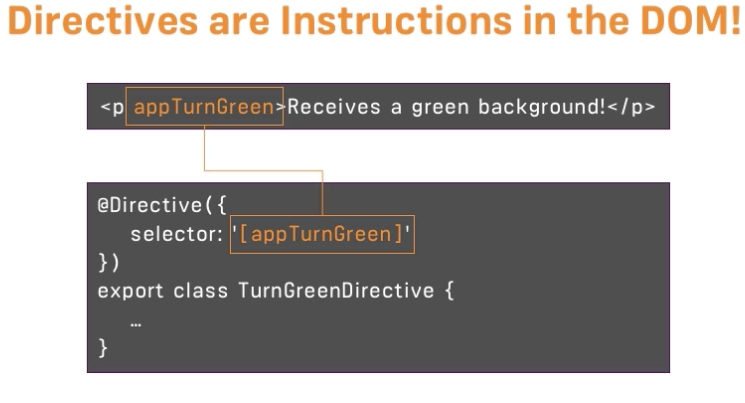
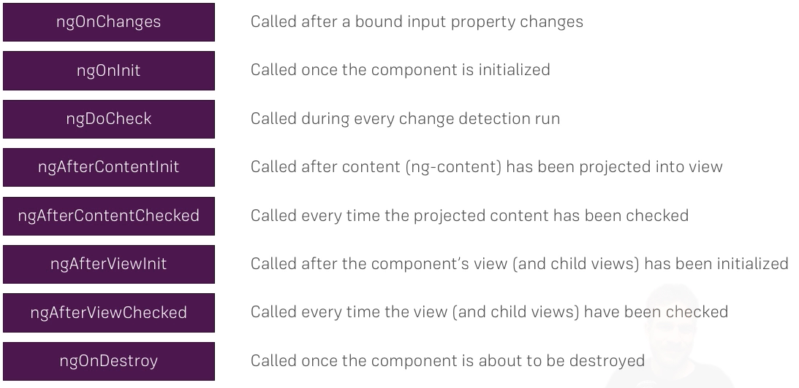
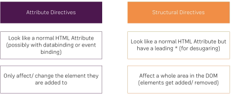
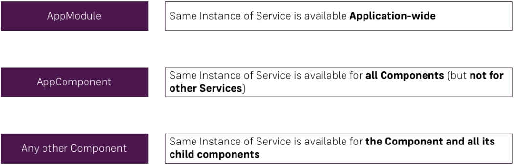

## Angular CLI

---
> If you have a project npm environment with an older version of
> Angular CLI installed there will be nagging. Disable it,like so:
>
>``` bash
>ng set --global warnings.versionMismatch=false
>```

test
test
test
test
---

## Create component
``` bash
ng generate component [name]
```

## Interactivity
$event Use to pass the event to the type scriptd
    


## Angular tutorial
Boost Devices copy
### Keyboard shortcuts

* QA section - q

### Two-Way-Binding
Links a form element to a variable both ways.

```javascript
[(ngModel)]="serverName"
```

>Important: For Two-Way-Binding to work, you need to enable the >ngModel  directive. 
>This is done by adding the FormsModule to the imports[]  array in the AppModule.

>You then also need to add the import from @angular/forms  in the >app.module.ts file:

>import { FormsModule } from '@angular/forms'; 


### Directives


### ngIf

```html
<p *ngIf="serverCreated">Server was created. Server name is {{ serverName}}</p>
```

### ngStyle
```html
<p [ngStyle]="{'background-color': getColor()}">This is a paragraph</p>
```

* `[ngstyle]` allows you to dynamically style an element according to css instruction. 


## Event Binding

* Properties of components are not public by default. To access a property of a 
  component from another component hosting it, do this:

```typescript
export class ServerElementComponent implements OnInit {
  @Input() element: {type: string, name: string, content: string};

  constructor() { }

  ngOnInit() {
  }

}
```

#### Alias
``` typescript
export class ServerElementComponent implements OnInit {
  @Input('srvElement') element: {type: string   , name: string, content: string};
}

```


## Lifecyle
When a component is created angular goes through some stages. We can hook into 
these with differnt methods such as:




## Directives

### Create Your Own Directive

The name of the directive

```bash
<NAME>.directive.ts
```


#### A Directive Statement
```typescript
import {Directive, ElementRef, OnInit, Renderer2} from '@angular/core';

@Directive({
  selector: '[appBetterHighlight]'
})
export class BetterHighlightDirective implements OnInit{

  constructor(private elRef: ElementRef, private renderer: Renderer2) { }

  ngOnInit() {
    this.renderer.setStyle(this.elRef.nativeElement, 'background-color', 'blue');
  }
}

```

* The brackets around the selector means that it is matched on attribute, like so:
 
    ```typescript
    <p appBasicHighlight>Style me with basic directive!</p>
    ```
    
* A directive can not implement all lifecycle elements only OnInit,

* Angular must be made aware of the directive

    ```typescript
    import {BasicHighlightDirective} from '<DIRECTIVE_PATH>';
    
    @NgModule({
      declarations: [
        AppComponent,
        BasicHighlightDirective
      ]
    })

    ```
    
* The [renderer][1] can be used to modify the DOM using a set of handy method such as 
  [setStyle][2] shown in the topmost example. You should never change the wrapped 
  nativeElement yourself. 
  
  [1]:https://angular.io/api/core/Renderer2
  [2]:https://angular.io/api/core/Renderer2#setStyle

* A preferred method is probably to use the @HostBinding decorator to bind to a
  property of the host element, like so:

    ```typescript
    @HostBinding('style.backgroundColor') backgroundColor: string = 
    'transparent';
    ```
* Binding to a event listener of the host element

    ```typescript
    @HostListener('mouseenter') mouseover (eventData: Event) {
        this.backgroundColor = this.highlightColor;
    }
    ```
* Dynamically attaching/detaching a class
  This binds the class open of the host element to the property isOpen of the 
  directive.

    ```typescript
    @HostBinding('class.open') isOpen = false;

### *ngSwitch

```html
<div [ngSwitch]="value">
  <p *ngSwitchCase="5">Value is 5</p>
  <p *ngSwitchCase="10">Value is 10</p>
  <p *ngSwitchCase="100">Value is 100</p>
  <p *ngSwitchDefault>Value is Default</p>
</div>
```

### Attributs vs Structural directives



## Services

---------------------------------------------------------------------------------------------------
 * Avoid code duplication and provide common datastorage to components in Angular.

A service is just a TypeScript class, like so:

```typescript
export class LoggingService {
  logStatusChange(status: string) {
    console.log('A server status changed, new status: ' + status);
  }
}
```

### Injecting service into components
The service needs to be injected into a component by.

* Adding it as a provider
    
    ```typescript
    @Component({
      selector: 'app-new-account',
      templateUrl: './new-account.component.html',
      styleUrls: ['./new-account.component.css'],
      providers: [LoggingService]
    })
    ```
* Passing it into the constructor

    ```typescript
    constructor(private loggingService: LoggingService) {}
    ```

### Hierarchical Injector



#### App Wide Service
If you want a service to be availible app wide make sure that it is only provided in the app
component but passed in the constructor of the other components. If it is provided in each of
the components a new instance of the service will be created for each of the components.

#### Make Service Allow Injections
```
@Injectable()
export class AccountsService {
```

#### Subscribe to events
```typescript
this.accountsService.statusUpdated.subscribe((status: string) => alert('New Status: ' + status)
```

## Random things

### Push multiple item to list

```javascript
this.ingredients.push(...ingredients);
```

## Routing

---------------------------------------------------------------------------------------------------

* Define routes

    ```typescript
    import {RouterModule, Routes} from '@angular/router';
    
    const appRoutes: Routes = [
      { path: '', component: HomeComponent },
      { path: 'users', component: UsersComponent },
      { path: 'servers', component: ServersComponent },
      { path: 'users', component: UsersComponent }
    ];
    ```

* Apply routes
    
    ```typescript
    @NgModule({
      declarations: [
        AppComponent,
        HomeComponent,
        UsersComponent,
        ServersComponent,
      ],
      imports: [
        RouterModule.forRoot(appRoutes)
      ],
      bootstrap: [AppComponent]
    })
    export class AppModule { }
    ```

* Use routes

    * In a template add:
    
        ```html
        <router-outlet></router-outlet>
        ```
    
    * Links
    
        ```html
        <li role="presentation" class="active"><a routerLink="/">Home</a></li>
        <li role="presentation"><a routerLink="/servers">Servers</a></li>
        <li role="presentation"><a [routerLink]=["/users"]>Users</a></li>
        ```
    * Show active router links


      The content of the `routerLinkActive` will be added as a class on the element it is applied
      to. In conjuction with bootstrap this makes the correct tab be selected. By the 
      default angular sees a route as active if the current path contains the routerlink. The
      `routerLinkActiveOptions` property allows us  to configure that behaviour.

        ```typescript
        <ul class="nav nav-tabs">
          <li role="presentation" routerLinkActive="active" [routerLinkActiveOptions]="{exact: true}">
            <a routerLink="/">Home</a>
          </li>
          <li role="presentation" routerLinkActive="active"><a routerLink="servers">Servers</a></li>
          <li role="presentation" routerLinkActive="active"><a [routerLink]="['users']">Users</a></li>
        </ul>
        ```
        
    * Use the router in a component
      It is possible to inject the router and navigate using the `this.router.navigate`
      method.
      
        ```typescript
        export class HomeComponent implements OnInit {
        
          constructor(private router: Router) { }
        
          onLoadServers() {
            // complex calculation
            this.router.navigate(['/servers']);
          }
        }

---------------------------------------------------------------------------------------------------


    return this.http.put('https://udemy-ng-recipes-39233.firebaseio.com/recipes.json?auth=' + token, this.recipeService.getRecipes(), {
      observe: 'body',
      headers: new HttpHeaders().set('Authorization', 'Bearer ')
    });

